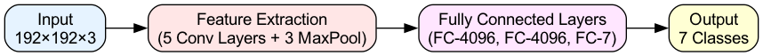
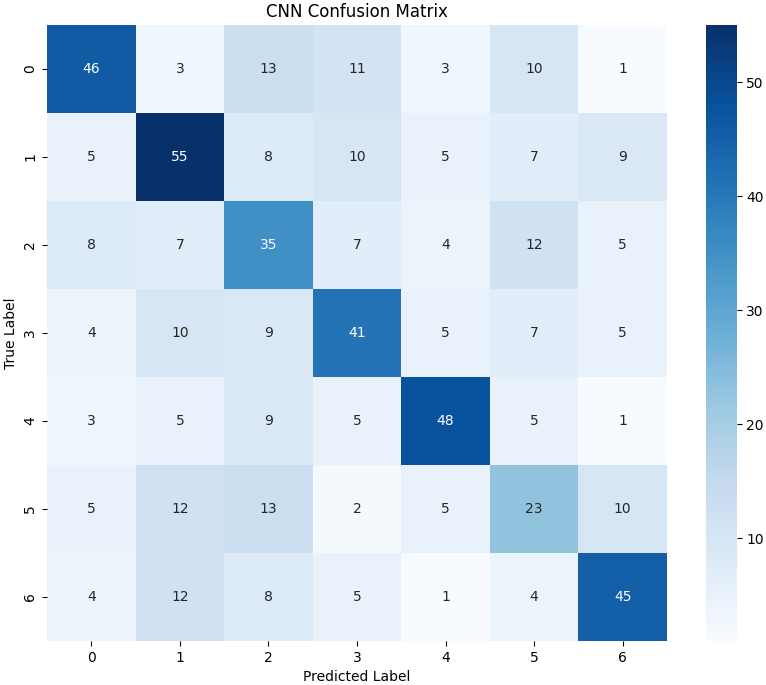
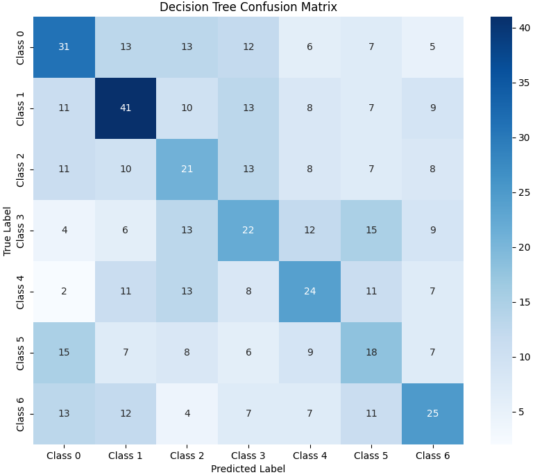

# UESTC-UofG ML Project 2: CNN for Image Classification

## Overview
This project is a personal course work of UESTC-UofG joint school, which explores the use of Convolutional Neural Networks (CNNs) for image classification, focusing on AlexNet and its performance compared to a Decision Tree Classifier. The task involves classifying images into seven distinct waste categories using the Combined COCO dataset. The project includes dataset preprocessing, model training, evaluation, and performance analysis.

## Objectives
1. Understand CNN architecture and its applications in deep learning.
2. Implement and train AlexNet for a 7-class classification task.
3. Compare AlexNet's performance with a Decision Tree Classifier using HOG features.
4. Analyze model performance using metrics like accuracy, precision, recall, F1 score, and confusion matrices.

## Dataset
The Combined COCO dataset is used, containing images and annotations for the following categories (due to the dataset size, it is not stored in this repository)
- Paper
- Metal
- Plastic
- Glass
- Food
- Hazardous
- Electronic

## Project Structure

```
GUID_FullName_ML-Code/
├── mlenv/                  # Python environment
├── Project2/
│   ├── 2024_uestc_autlab/
│   │   ├── data/
│   │   │   └── coco/        # Original COCO dataset
│   │   │   │   ├── JPEGImages/
│   │   │   │   └── annotations.json
│   │   │   ├── data_coco_test/annotations.json   # This will be generated
│   │   │   ├── data_coco_train/annotations.json  # This will be generated
│   │   │   └── data_coco_valid/annotations.json  # This will be generated
│   │   ├── split3.py
│   │   ├── train.py
│   │   ├── model.py
│   │   ├── dataset.py
│   │   ├── evaluate.py
│   ├── image/
│   │   └── confusion_matrix_final.png
├── Lab4/
│   ├── coco/
│   │   ├── annotations.json
│   │   └── JPEGImages/
│   ├── image/
│   │   └── confusion_matrix_decision_tree.png
│   ├── 2024_uestc_autlab/
│   │   ├── outputs/
│   │   ├── utils/
│   │   ├── dataset.py
│   │   ├── ml_evaluate.py
│   │   └── ml_model.py
```


## Key Components

### 1. Data Loading and Preprocessing
- Cropping images based on bounding boxes from annotations.
- Resizing images to 192x192 pixels.
- Normalizing RGB channels using predefined mean and standard deviation.

### 2. Model Implementation
- **AlexNet:** Includes convolutional layers, max-pooling layers, fully connected layers, and softmax activation for classification.



- **Decision Tree Classifier:** Utilizes HOG features and PCA for dimensionality reduction.

### 3. Model Training
- **Loss Function:** CrossEntropyLoss for classification tasks.
- **Optimizer:** Adam optimizer with weight decay for AlexNet.
- Save the best model weights as `best_model.pth`.

### 4. Evaluation and Performance Analysis
- Compute and visualize confusion matrices.
- Measure performance using metrics: accuracy, precision, recall, and F1 score.

### 5. Visualization
- Heatmaps for confusion matrices.
- Network architecture visualizations.

## Results
| Metric        | AlexNet  | Decision Tree |
|---------------|----------|---------------|
| Accuracy      | 51.40%   | 31.93%        |
| Precision     | 0.52     | 0.32          |
| Recall        | 0.51     | 0.31          |
| F1 Score      | 0.52     | 0.32          |

Confusion matrices and detailed classification reports are included in the `image/` directory.





## How to Run

### AlexNet

Run the project in the following order:

```bash
cd ./project2/2024_uestc_autlab/
python split3.py
python dataset.py
python train.py
python evaluate.py
```

### Decision Tree Classifier

```bash
cd ./Lab4/2024_uestc_autlab/
python train.py
python ml_evaluate.py
```

## Results:
Check the `outputs/` directory for trained model weights and metrics. Confusion matrices are saved in the `image/` directory. Check out `Report.pdf` for detailed explanation. Sorry for possible minor issues in this report.

## Conclusion

AlexNet significantly outperforms the Decision Tree Classifier in this image classification task, demonstrating the strength of deep learning in handling high-dimensional and complex image data.

---
**Author**: Jinming Ren (3191293752@qq.com)